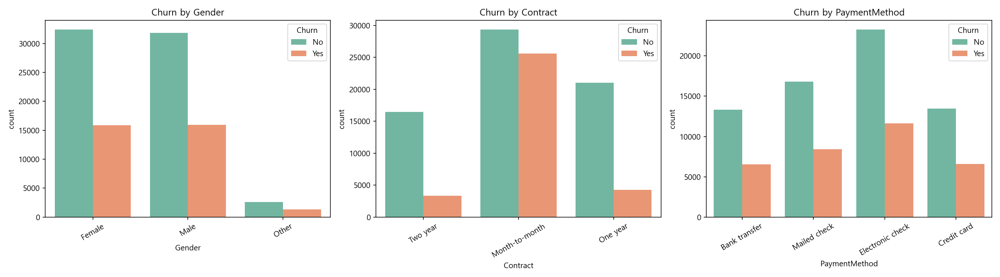

<!-- EDA_report.md -->
# 탐색적 데이터 분석(EDA) 결과 보고서

**프로젝트 명:** 고객 이탈(Churn) 예측 모델 구축을 위한 데이터 탐색

**분석 데이터:** synthetic_customer_churn_100k.csv  
(출처 : https://www.kaggle.com/datasets/dhrubangtalukdar/telco-customer-churn-data)

---

## 1. 데이터 개요 및 구조 분석

* **데이터 규모:** 총 100,000행(Rows), 9열(Columns)
* **결측치 현황:** 모든 변수의 Non-Null Count가 100,000개로 일치하여 결측치 미존재
* **변수 타입 구성:**
  * **수치형(Numerical) 변수:** `CustomerID`, `Age`, `Tenure`, `MonthlyCharges`, `TotalCharges` (5개)
  * **범주형(Categorical) 변수:** `Gender`, `Contract`, `PaymentMethod`, `Churn` (4개)

---

## 2. 수치형 변수 기초 통계량 및 데이터 이상치 분석

각 수치형 변수의 기술 통계 정보(`df.describe()`)를 분석한 결과, 머신러닝 모델링 전에 반드시 인지해야 할 몇 가지 특이사항과 오류가 발견되었습니다.

| 변수명 | 평균값 (Mean) | 중위값 (50%) | 최솟값 (Min) | 최댓값 (Max) | 주요 특징 분석 |
| :--- | :---: | :---: | :---: | :---: | :--- |
| **Age** (나이) | 49.0세 | 49.0세 | 18.0세 | 80.0세 | 18세부터 80세까지 아주 고르게 분포된 정상 데이터입니다. |
| **Tenure** (가입기간) | 36.5개월 | 37.0개월 | 1.0개월 | 72.0개월 | 최소 1개월에서 최대 6년(72개월)까지의 가입 기간을 가집니다. |
| **MonthlyCharges** (월요금) | 79.9달러 | 80.0달러 | 10.0달러 | 150.0달러 | 최소 10달러~최대 150달러 사이에서 균등하게 청구되고 있습니다. |
| **TotalCharges** (총요금) | 2,926.1달러 | 2,268.0달러 | **-118.43달러** | 10,831.5달러 | **[오류 발견]** **최솟값이 음수(-118.43)** 인 데이터가 존재합니다. |

### ⚠️ 중요 데이터 오류 파악
* **TotalCharges의 음수(-) 값:** 총 청구 금액에 마이너스 값이 잡혀 있습니다. 이는 환불, 프로모션 크레딧 또는 시스템 기록 오류일 수 있으므로 **0 이하의 값은 0으로 대체하거나 해당 행을 제거하는 전처리**가 필요합니다.
* **데이터의 치우침 (Skewness):** `TotalCharges`는 평균(2,926)이 중위값(2,268)보다 확연히 높습니다. 이는 대다수 고객은 적은 금액을 내지만, 장기 가입자 중 일부 헤비 유저가 큰 금액을 지불하여 **오른쪽 꼬리가 긴(Right-skewed) 분포**를 형성하고 있음을 뜻합니다.

---

## 3. 타겟 변수(Churn) 분포 분석

모델이 예측해야 하는 핵심 타겟 변수인 **고객 이탈 여부 (`Churn`)** 의 비율을 파악했습니다.

* **이탈하지 않은 고객 (No):** 66,856명 (**66.86%**)
* **이탈한 고객 (Yes):** 33,144명 (**33.14%**)

### 💡 클래스 불균형 분석
일반적인 기업의 이탈 데이터는 이탈자 비율이 5~10% 미만인 극심한 불균형 데이터가 많으나, 본 데이터는 이탈률이 **약 33%** 로 꽤 높은 편입니다. 따라서 모델 학습 시 적절한 불균형 전처리를 적용함으로써 모델이 안정적으로 이탈 패턴을 학습할 수 있는 환경을 만들어 주는 것이 좋습니다.

---

## 4. 변수 간 상관관계 분석 (Correlation Matrix)

`Churn` 변수를 수치화(Yes=1, No=0)하여 연속형 변수들과의 선형 상관관계를 분석한 결과입니다.

* **다중공선성(Multicollinearity) 확인:** `TotalCharges`(총 청구액)는 `Tenure`(가입 기간) 및 `MonthlyCharges`(월 청구액)와 매우 강한 양의 상관관계를 보입니다. (논리 공식인 $TotalCharges \approx Tenure \times MonthlyCharges$가 성립함을 보여줌.)
* **모델 연계:** Random Forest, Gradient Boosting, XGBoost, LightGBM은 트리 기반 앙상블 모델이기 때문에 성능(예측력) 자체에는 거의 영향이 없습니다.  하지만 변수중요도 분석을 해야한다면 높은 상관관계의 변수를 제거하는 것이 좋습니다.  Deep Learning은 수학적으로 경사하강법(Gradient Descent)과 가중치 연산을 사용하기 때문에 성능과 학습 안정성에 직접적인 타격을 받을 수 있습니다.  따라서 높은 상관관계의 변수를 제거하거나 강력한 규제를 가하는 것이 좋습니다.

---

## 5. EDA 최종 결론 및 모델링을 위한 전략

EDA를 통해 도출된 인사이트를 바탕으로, **모델 성능을 극대화하기 위한 4가지 핵심 전처리 전략**은 다음과 같습니다.

1. **이상치 및 데이터 오류 처리**
   * `TotalCharges` 열에서 발견된 음수 값(`-118.43`)들을 제거하거나 `0`으로 채워주는 이상치 정제 작업을 필수로 진행합니다.
2. **범주형 변수의 인코딩(Encoding)**
   * `Gender`, `Contract`, `PaymentMethod` 등 문자열 범주형 데이터는 숫자로 바꿔야 모델이 이해할 수 있습니다.
   * 따라서 적절한 인코딩을 진행합니다.
3. **데이터 스케일링(Scaling) 생략 가능**
   * `Age`(수십 단위)와 `TotalCharges`(만 단위)는 스케일 차이가 매우 큽니다.
   * 트리 기반 앙상블 모델은 값의 절대적 크기가 아닌 '대소 관계(Rank)'를 기준으로 데이터를 쪼개기 때문에 스케일링 전처리를 생략할 수 있습니다.
4. **파생 변수(Feature Engineering) 추천**
   * 고객의 가입 기간 대비 총 지불 금액의 비율을 나타내는 `TotalCharges / Tenure` (즉, 실제 인당 평균 월 지불 가치) 등의 파생 변수를 추가하면 이탈 모델의 예측력을 더욱 날카롭게 끌어올릴 수 있을 것입니다.

---
*본 보고서는 EDA.ipynb 내 소스코드와 통계적 지표를 기반으로 작성되었습니다.*