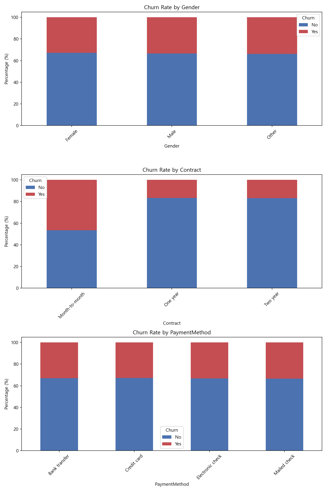
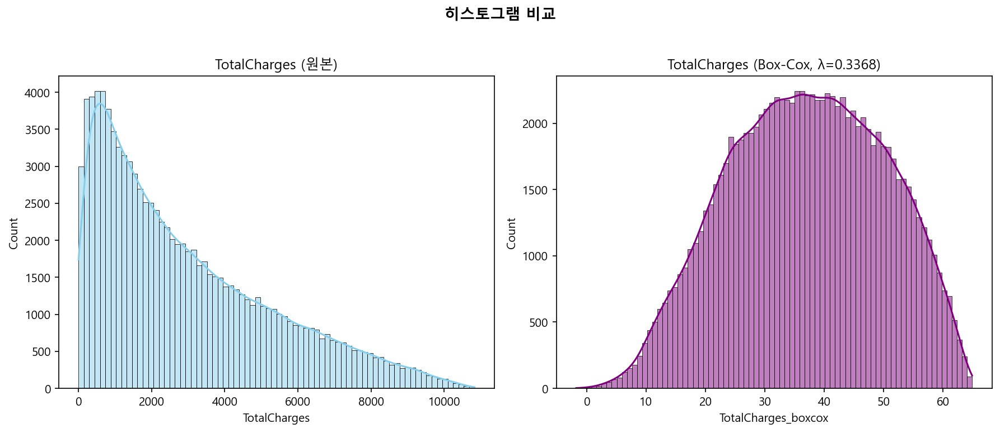
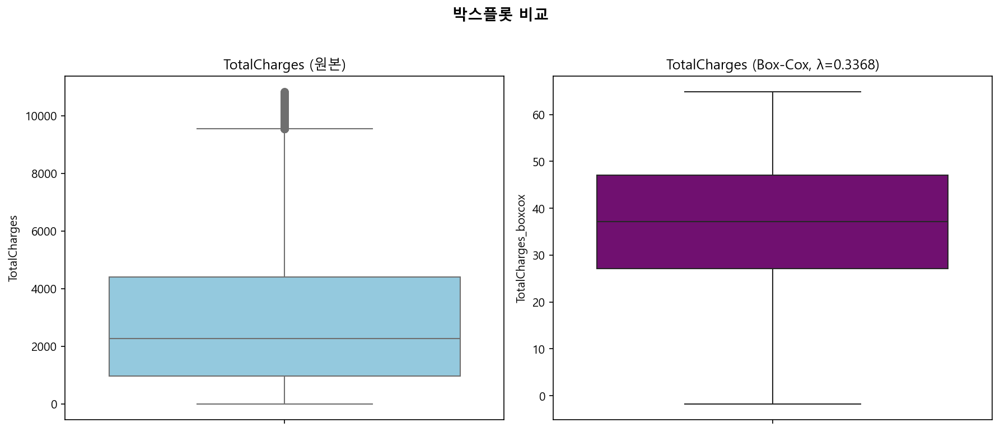

# 탐색적 데이터 분석보고서와 데이터 전처리 결과보고서(EDA & Preprocessing Report)

**프로젝트**: 통신사(Telco) 고객 이탈(churn) 예측 모델링 구축

**데이터셋**: synthetic_customer_churn_100k.csv 
(출처 : https://www.kaggle.com/datasets/dhrubangtalukdar/telco-customer-churn-data)

## 1. 데이터셋 개요

- **가상 통신사 Telco**의 고객 이탈(churn) 자료
- 모든 데이터는 Python(pandas + numpy)로 시드 고정 후 생성한 **가공 데이터**
- 데이터셋은 총 100,000행(Rows), 9열(Columns)로 구성
- **변수 타입 구성:**
  * **수치형(Numerical) 변수:** `CustomerID`, `Age`, `Tenure`, `MonthlyCharges`, `TotalCharges` (5개)
  * **범주형(Categorical) 변수:** `Gender`, `Contract`, `PaymentMethod`, `Churn` (4개)

※ 통신사 고객 이탈 가공 데이터의 시초는 IBM Cognos Analytics용 샘플 데이터로 제공된 Telco Customer Churn이다. 이후 Kaggle에서 비슷한 유형의 데이터셋을 찾아볼 수 있으며 synthetic_customer_churn_100k도 그중 하나다.

### 1.1 변수에 대한 설명

| 컬럼명 | 설명 | 데이터 타입 | 예시 |
|---|---|---|---|
| CustomerID | 고객 고유 식별자 | int | 1, 2, …, 100000 |
| Age | 고객 나이 (18–80세) | int | 51 |
| Gender | 고객 성별 | string | Male / Female / Other |
| Tenure | 서비스 이용 기간 (월, 1–72) | int | 58 |
| MonthlyCharges | 월 청구 금액 (USD, 약 10–150) | float | 95.92 |
| TotalCharges | 누적 청구 금액 (Tenure × MonthlyCharges + 노이즈) | float | 5530.46 |
| Contract | 계약 유형 | string | 월별 / 1년 / 2년 |
| PaymentMethod | 결제 수단 | string | 전자수표 / 우편수표 / 계좌이체 / 신용카드 |
| Churn | 이탈 여부 (타깃 변수) | string | Yes / No |  
 

# 2. 수치형 변수와 기초 통계량

| 변수명 | 평균값 (Mean) | 중위값 (50%) | 최솟값 (Min) | 최댓값 (Max) | 주요 특징 분석 |
| :--- | :---: | :---: | :---: | :---: | :--- |
| **Age** (나이) | 49.0세 | 49.0세 | 18.0세 | 80.0세 | 18세부터 80세까지 분포 |
| **Tenure** (가입기간) | 36.5개월 | 37.0개월 | 1.0개월 | 72.0개월 | 최소 1개월에서 최대 6년(72개월)까지의 가입 기간 |
| **MonthlyCharges** (월요금) | 79.9달러 | 80.0달러 | 10.0달러 | 150.0달러 | 최소 10달러~최대 150달러 사이에서 월요금 청구 |
| **TotalCharges** (총요금) | 2,926.1달러 | 2,268.0달러 | **-118.43달러** | 10,831.5달러 | **[오류 발견]** **총요금이 음수인 데이터(최소값: -118.43)** 가 존재 |

## 2.1 수치형 변수의 도수분포표

## 2.2 수치형 변수의 Target 특성별 분포

- 가입기간이 짧을수록 이탈률이 높음
- 월요금이 많을수록 이탈률이 높음

# 3. 범주형 변수와 기초 통계량

| 변수 | 범주 | 빈도 | 비율 | 주요 특징 분석 |
|------|------|-----:|-----:|------|
| **Gender** | Female | 48,256 | 48.26% | Female·Male 비율이 각각 약 48%로 균등한 분포 |
| | Male | 47,787 | 47.79% | |
| | Other | 3,957 | 3.96% | |
| **Contract** | Month-to-month | 54,915 | 54.92% | 단기 계약(Month-to-month)이 과반수(54.92%)로 중장기 계약간 이탈률 차이가 있을 것으로 예상 |
| | One year | 25,261 | 25.26% | |
| | Two year | 19,824 | 19.82% | |
| **PaymentMethod** | Electronic check | 34,892 | 34.89% | Electronic check가 34.89%로 가장 많고 나머지 3개 방식은 약 20%씩 고른 분포|
| | Mailed check | 25,221 | 25.22% | |
| | Credit card | 20,032 | 20.03% | |
| | Bank transfer | 19,855 | 19.86% | |

## 3.1 범주형 변수의 도수분포표

## 3.2 범주형 변수의 Target 특성별 비율

- 단기계약일수록 이탈률아 높음

# 4. 타겟 변수(Churn) 분포 분석

모델이 예측해야 하는 핵심 타겟 변수인 **고객 이탈 여부 (`Churn`)** 비율 분석

- **이탈하지 않은 고객 (No):** 66,856명 (**66.86%**)
- **이탈한 고객 (Yes):** 33,144명 (**33.14%**)
- **클래스 불균형 분석** 
  - Telco의 이탈률은 **약 33%** 로 국내 통신 3사 실제 이탈률 보다 높은 편
 

  **국내 통신 3사 해지율**

  | 연도 | SKT | KT | LGU+ | 출처 |
  |------|----:|----:|-----:|------|
  | 2021년 (연간, 월평균) | 0.83% | 1.43% | 1.36% | 서울경제 (2022.03.08) |
  | 연간 환산 (×12) | ≈ 10.0% | ≈ 17.2% | ≈ 16.3% | — |

 

# 5. 변수 간 상관관계 분석 (Correlation Matrix)

Target['Churn`] 변수를 LabelEcoder로 수치화(Yes=1, No=0)하여 연속형 변수 상관관계 분석

* **상관관계(Correlation) 분석** 
  - `TotalCharges`(총요금)는 `Tenure`(가입 기간) 및 `MonthlyCharges`(월요금)와 상관계수가 각각 0.70과 0.62로 강한 양의 상관관계를 보임(TotalCharges가 Tenure × MonthlyCharges + 노이즈임)

* **다중공선성(Multicollinearity) 분석** 
  - 통계학에서는 VIF값이 5이상이면 다중공선성 문제가 있다고 판단하여 상관관계가 있는 변수들 중에서 선택하여 제거함으로써 다중공선성 문제를 해결
  - Random Forest, Gradient Boosting, XGBoost, LightGBM 등은 트리 기반 앙상블 머신러닝 모델이기 때문에 설령 다중공선성 문제가 있더라고 성능(예측력) 자체에는 영향이 없음
  - 뿐만아니라 target을 예측하기 위한 features 개수가 7개 밖에 없어 여기에서 추가로 삭제를 한다면 예측력이 떨어질 것으로 예상되어 다중공선성 문제에 대한 처리는 하지 않음

  **VIF 분석 결과**

   | 변수 | VIF | 판단 |
    |------|----:|------|
    | TotalCharges | 11.164562 | 심각 (제거 또는 결합 고려) |
   | Tenure | 8.949542 | 중간 (주의 필요) |
   | MonthlyCharges | 8.319921 | 중간 (주의 필요) |
    | Age | 6.087550 | 중간 (주의 필요) |

  **VIF 해석 기준**
  - VIF = 1 : 다중공선성 없음
  - 1 ~ 5 : 낮음 (허용 가능)
  - 5 ~ 10 : 중간 (주의 필요)
  - 10 이상 : 심각 (제거 또는 결합 고려)
 

# 6. 결측치와 이상치 분석

- **결측치 현황** 
  - 모든 변수의 Non-Null Count가 100,000개로 일치하여 결측치 미존재
- **이상치 현황**
  - 총요금에 음수(-)값이 있고 이는 환불, 프로모션 크레딧 또는 시스템 기록 오류일 수 있으므로 **데이터 전처리**가 필요
  - 뿐만아니라 총요금의 Box-plot 상 상한값을 벗어나는 이상치가 존재하여 **데이터 전처리**가 필요

# 7. 데이터 전처리

## 7.1 이상치 처리

### 7.1.1 TotalCharges(총요금)의 음수(-)값 처리
- 총 100,000개 중 265개(0.265%)의 음수(-)가 존재
- 환불, 프로모션 크레딧 또는 시스템 기록 오류 가능성
- 전처리 방법
  1. 음수(-)를 0으로 대채
  2. 음수(-) 행 삭제
- 원인을 모르기 때문에 **<u>행 삭제</u>** 추천

### 7.1.2 TotalCharges(총요금)의 상한 이상치 처리
- 총 100,000개 중 이상치 기준 상한인 9540.32를 벗어난 이상치가 841개(0.841%)가 존재
- 장기 고객의 경우 자연스러운 현상
- 전처리 방법
  1. 이상치 단순 삭제
  2. 음수(-) 행 삭제 후 BOX-COX 변환
- 로그변환은 왜도현상과 이상치 제거를 하지못해 **<u>BOX-COX 변환</u>** 추천

### 7.1.3 TotalCharges(총요금)의 이상치 처리 전후 비교

## 7.2 Feature와 Target 분리(X, y 분리)

- 총 컬럼(9개): CustomerID, Age, Gender, Tenure, MonthlyCharges, Contract, PaymentMethod, TotalCharges, Churn
  - CustomerID는 삭제
- feature(7개): Age, Gender, Tenure, MonthlyCharges, Contract, PaymentMethod, TotalCharges 
  - categorical_columns = ['Gender', 'Contract', 'PaymentMethod'] 
  - numerical_columns = ['Tenure', 'MonthlyCharges', 'TotalCharges', 'Age']
- target(1개): Churn
  - target은 LabelEncoder을 통해 Yes를 0으로 , No를 1로 변환

  | 구분 | 레이블 | 의미 | 건수 |
  |------|--------|------|-----:|
  | 변환 전 | No | 유지 | 66,856 |
  | 변환 전 | Yes | 이탈 | 33,144 |
  | 변환 후 | 0 | 유지 | 66,856 |
  | 변환 후 | 1 | 이탈 | 33,144 |

## 7.3 Train/Validation/Test set 분리

- train set(60%), validation set(20%), test set(20%)로 분리하여 데이터 준비

  | 변수 | 크기 |
  |------|-----:|
  | X_train | 60,000 |
  | y_train | 60,000 |
  | X_val | 20,000 |
  | y_val | 20,000 |
  | X_test | 20,000 |
  | y_test | 20,000 |

## 7.4 OneHotEncoding과 labelEcoding
- 범주형(categorical) 변수에 대해서는 LabelEncoding을 함
- 참고 사항 참조

## 7.5 Scaling
- 수치형(numeric) 변수에 대해서는 별도의 Scaling를 하지 않음
- 참고 사항 참조

## 7.6 참고 사항

**- 머신러닝에서의  Encoding과 Scaling 방법**

| 척도 | | 예 | 대소관계 | 차이 | 비 | 선형기반 모델 | 트리기반 모델 |
|---|---|---|:---:|:---:|:---:|---|---|
| 범주형 | 명목척도 | 학생번호 | ✕ | ✕ | ✕ | `OneHotEncoder(drop='first')` | `OneHotEncoder` → `LabelEncoder()` 가능 |
| | 순서척도 | 성적 순위 | ○ | ✕ | ✕ | `LabelEncoder()` | `LabelEncoder()` |
| 수치형 | 간격척도 | 온도 | ○ | ○ | ✕ | Scaling 필요 | Scaling 불필요 |
| | 비율척도 | 키 | ○ | ○ | ○ | Scaling 필요 | Scaling 불필요 |

- 설명력을 강조하는 통계학과 예측력을 중시하는 머신러닝에는 변수를 Encoding하고 Scaling하는 방법상 차이가 있음
- 통계학에서는 독립변수들  간에 다중공선성 문제가 발생하면 종속변수에 대한 설명력이 떨어지기 때문에 다중공선성 문제를 적극적으로 처리
- 반면 머신러닝에서는 설명력보다는 예측 결과를 중시하기 때문에 통계학에서보다는 다중공선성 문제가 덜 중요시됨
- 머신러닝에서도 선형기반 모델에서는 통계학과 가깝게 다중공선성 문제를 바라보지만 트리기반 모델은 다중공선성 문제가 훨씬 덜 중요시됨
- 명목변수를 OneHotEncodind할 때 통게학이나 선형기반 머신러닝 모델에서는 다중공선성 문제를 방지하기 위해 첫번째 열을 삭제하는 방법을 사용하여 더미(dummy)변수화 함(OneHotEncoder(drop='first'))
- 그러나 트리기반 모델에서는 첫번째 열을 삭제하면 설명력이 떨어지기 때문에 OneHotEncoding할 때 첫번째 열을 삭제하지 않고 사용하며 더 나아가 데이터 전처리의 편의성을 위해 실무적으로는 순서척도에 사용되는 LabelEncoding 방식을 선호
- scaling에 있어서도 통계학과 선형기반 머신러닝 모델에서는 scaling이 반드시 필요하지만 트리기반 머신러닝 모델에서는 불필요

\* 선형 알고리즘: Logistic Regression(Linear Regression), SVM, KNN 
\* 트리형 알고리즘: Decision Tree, Random Forest, Gradient Boosing(XGBoost, LightGBM, CatBoost)

## 7.7 향후 과제: 파생변수 생성을 통한 추가 분석

- synthetic_customer_churn_100k 데이터 셋은  수치형(Numerical) 변수 4개(`Age`, `Tenure`, `MonthlyCharges`, `TotalCharges`)와 범주형(Categorical) 변수 3게(`Gender`, `Contract`, `PaymentMethod`) 구성된 features들로 target인 이탈를을 예측하려고 함.
- features 수 부족이 target 예측력을 떨어뜨릴 수 있다는 가정하에 features 수 확대 방안 모색
- 통계학에서는 연구자가 도메인(domain) 지식을 바탕으로 설명력을 높일 수 있는 방향으로 feature 상호간의 연산을 통해 새로운 파생변수를 생성
- 머신러닝에서는 모델이 자동으로 feature를 대량 생성한 뒤 알아서 선택하게 함
- 선형기반 머신러닝 모델에서 사용하는 PolynomialFeatures라는 다항식 특성을 생성하는 변환기인 PolynomialFeatures가 대표적인 예

- 검토 가능한 파생변수
  1. 범주형 변수를 수치화하는 방법으로 새로운 파생변수 생성
      - 범주형 변수를 수치화하는 대표적 방법으로는 OneHotEncoder와 LabelEncoder 있음

  2. 수치형 변수를 군집화하여 그룹별로 분석 
      - 개별 연령보다는 연령대가 이탈률을 예측하는데 더 유의할 것이라는 가정하에 새로운 파생변수를 생성
      - 머신러닝의 비지도학습인 군집분석(Clustering) 활용 가능

  3. TotalCharges/Tenure
      - TotalCharges는 '총요금으로 Tenure × MonthlyCharges + 노이즈'으로 분해 가능한데 노이즈를 없앤 실질 월요금이라는 파생변수를 생성

  4. Tenure/(Age * 12개월)
      - 단순 가입기간보다는 생애주기에서 차지하는 가입기간 비율이 이탈률을 예축하는데 더 유의할 것이라는 가정하에 새로운 파생변수를 생성